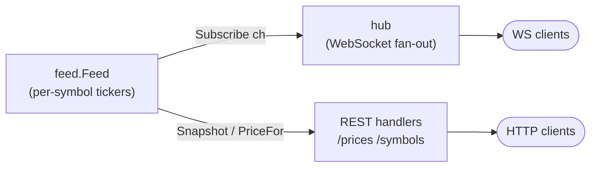
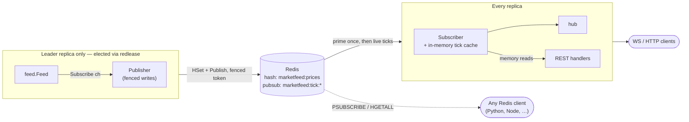

# marketfeed

A small Go service that simulates a futures market-data feed — streaming price ticks over WebSocket and serving REST snapshots — demonstrating the distributed-systems patterns a real feed service uses. Each symbol follows a random walk scaled by its own volatility and snapped to the instrument's exchange tick size. Prices are simulated, so it runs with nothing but Go (and optionally Redis).

---

## What this demonstrates

The codebase stays deliberately small, demonstrating a handful of production patterns end to end:

- **Concurrency** — channel fan-out from one feed to independent consumers, per-symbol ticker goroutines, two mutexes on one struct so channel sends never hold the price lock, atomics for readiness and counters, context-driven shutdown, `goleak` in tests
- **WebSocket** — connection lifecycle (upgrade, pumps, ping) delegated to [melody](https://github.com/olahol/melody); snapshot-on-connect guaranteed ahead of live ticks, per-client symbol filtering, slow consumers drop ticks rather than buffer without bound
- **Redis** — pub/sub fan-out, hash as the shared snapshot store, leader election via [redlease](https://github.com/nijatsdev/redlease) (a library extracted from this project), and fencing tokens enforced in Lua: every write carries its leadership term's token, so a superseded leader's stale writes are rejected at Redis
- **Failover continuity** — a new leader seeds prices and session stats (open/high/low) from the last published state instead of starting over; seeds older than a few minutes are ignored, so continuity applies to failovers, not to resurrected old sessions
- **Testing** — consumer-side interfaces, `miniredis` for hermetic unit tests including the full election wiring, `REDIS_ADDR`-gated integration tests against a real Redis (the real Lua engine), race detector everywhere
- **Observability** — Prometheus metrics with bounded label cardinality, a `/status` introspection endpoint, structured `log/slog` logging, liveness/readiness probes

### Scope

This models the human-facing feed tier — the layer downstream of an exchange that serves apps and dashboards — not the colocated fast path (UDP multicast, kernel bypass, sub-microsecond latency), which is a different transport and latency tier than WebSocket and JSON. The prices are simulated and labeled as such; the snapshot store, pub/sub fan-out, and leader election are the parts built like a real service.

## Project layout

```text
.
├── main.go                 env config, signal handling, calls server.Run
├── Dockerfile
├── Makefile
└── internal/
    ├── feed/               price simulation — Tick/Spec types, random-walk model, session stats, fan-out
    ├── hub/                WebSocket fan-out via melody — snapshot on connect, symbol filters
    ├── metrics/            Prometheus metric definitions
    ├── redis/              connect, fenced publisher, subscriber
    └── server/             HTTP wiring, REST handlers, middleware, probes, /status
```

## Architecture

**Standalone** (no `REDIS_URL`) — the feed is the direct source for both the WebSocket hub and the REST handlers:



**Clustered** (`REDIS_URL` set) — one elected leader generates prices into Redis; every replica (leader included) serves clients from Redis, so all return identical data and clients survive failover:



The dashed edge is the language-agnostic path: a consumer in any language can read Redis directly instead of going through this service (see [Redis integration](#redis-integration)).

---

## Quick start

```bash
docker run --rm -p 8080:8080 ghcr.io/nijatsdev/marketfeed
# or from source:
go run .
```

```bash
curl http://localhost:8080/prices/ES
curl http://localhost:8080/symbols
```

---

## API

### WebSocket — `GET /ws/stream`

Streams a JSON tick per symbol on each interval. Filter with `?symbols=ES,NQ` (case-insensitive). On connect, a snapshot of every subscribed symbol arrives before live ticks.

```json
{
  "symbol": "ES",
  "price": 7502.25,
  "bid": 7502.00,
  "ask": 7502.50,
  "open": 7500.00,
  "high": 7508.50,
  "low": 7496.75,
  "timestamp": "2026-05-01T10:23:45.123Z",
  "spec": {
    "exchange": "CME",
    "description": "E-mini S&P 500",
    "multiplier": 50,
    "tick_size": 0.25,
    "tick_value": 12.5,
    "initial_margin": 12000
  }
}
```

`open`/`high`/`low` are session stats for the price series as a whole — tracked server-side and carried across leader failover, so every client sees the same values.

### REST

| Method | Path | Description |
| --- | --- | --- |
| `GET` | `/prices` | Snapshot for all symbols (same shape as WS ticks) |
| `GET` | `/prices/{symbol}` | Single symbol, case-insensitive |
| `GET` | `/symbols` | All symbols with contract specs |

### Operations

| Path | Description |
| --- | --- |
| `GET /status` | Instance state as JSON — `redis`, `role` (standalone/electing/leader/follower), `fence`, `ws_clients`, `ready`, `tick_interval_ms`, `symbol_intervals_ms`. Per-instance, not cluster-wide |
| `GET /metrics` | Prometheus metrics |
| `GET /livez` | Liveness — `200` once the process is up |
| `GET /readyz` | Readiness — `200` once every symbol has ticked |

Key metrics: `marketfeed_ticks_total{symbol}`, `marketfeed_ws_clients`, `marketfeed_ws_ticks_dropped_total`, `marketfeed_redis_publish_errors_total`, `marketfeed_ticks_fenced_total`, `marketfeed_election_errors_total`, `marketfeed_http_request_duration_seconds{method,route,status}`.

---

## Contracts

Defined in [internal/feed/symbols.yaml](internal/feed/symbols.yaml) — the defaults:

| Symbol | Description | Exchange | Tick Size | Multiplier | Initial Margin |
| --- | --- | --- | --- | --- | --- |
| ES | E-mini S&P 500 | CME | 0.25 | $50 | $12,000 |
| NQ | E-mini Nasdaq-100 | CME | 0.25 | $20 | $16,500 |
| RTY | E-mini Russell 2000 | CME | 0.10 | $50 | $7,500 |
| YM | E-mini Dow Jones | CBOT | 1.00 | $5 | $9,000 |
| CL | Crude Oil | NYMEX | 0.01 | $1,000 | $6,000 |
| NG | Natural Gas | NYMEX | 0.001 | $10,000 | $3,500 |
| GC | Gold | COMEX | 0.10 | $100 | $9,000 |
| SI | Silver | COMEX | 0.005 | $5,000 | $8,000 |
| ZB | 30-Year T-Bond | CBOT | 0.03125 | $1,000 | $3,200 |
| ZN | 10-Year T-Note | CBOT | 0.015625 | $1,000 | $1,800 |
| 6E | Euro FX | CME | 0.00005 | $125,000 | $2,400 |
| 6J | Japanese Yen | CME | 0.0000005 | $12,500,000 | $2,200 |

---

## Configuration

| Variable | Default | Description |
| --- | --- | --- |
| `PORT` | `8080` | HTTP and WebSocket listen port |
| `TICK_INTERVAL_MS` | _(catalog, else 1000)_ | Tick cadence in ms: a bare number applies to every symbol, `SYM:ms` entries to one, e.g. `1000,NQ:300` — see [Custom symbols](#custom-symbols) |
| `VOLATILITY_MULTIPLIER` | `1.0` | Scale volatility across all symbols |
| `REDIS_URL` | _(disabled)_ | Enables pub/sub mirroring, snapshot hash, and leader election |
| `SYMBOLS_FILE` | _(built-in catalog)_ | Path to a YAML catalog (same schema as `symbols.yaml`) that replaces the built-in one at startup |

```bash
make run TICK_INTERVAL_MS=100 REDIS_URL=redis://localhost:6379
```

### Custom symbols

The symbol catalog lives in one file: [internal/feed/symbols.yaml](internal/feed/symbols.yaml). Add, edit, or remove entries there — it is embedded at build time, and `make watch` rebuilds on save, so editing it feels like hot reload. To swap the catalog without rebuilding, point `SYMBOLS_FILE` at a YAML file with the same schema (a mounted ConfigMap, for instance); it replaces the built-in list wholesale and is validated with the same rules. A minimal entry needs just a tick size and a starting price:

```yaml
BTC:
  description: Bitcoin Future
  exchange: CME
  tick_size: 5
  base_price: 65000
  volatility: 0.002    # optional: fractional move per tick (default 0.001)
```

Each entry's `tick_interval_ms` sets that contract's cadence — the built-in catalog gives every symbol its own (ES/NQ fastest, thinner contracts slower). `TICK_INTERVAL_MS` adjusts cadences at runtime without touching the file: a bare number applies to every symbol, `SYM:ms` entries to single ones, and they combine — `TICK_INTERVAL_MS=1000,NQ:300` runs everything at 1s except NQ. Precedence, most specific first: `SYM:ms`, then the bare number, then the catalog's `tick_interval_ms`, then 1000ms; `/status` reports the result per symbol. Changes apply on restart; with Redis enabled, prices and session stats survive the restart, so a catalog edit doesn't reset the running series.

---

## Redis integration

With `REDIS_URL` set, every tick is mirrored into Redis; if Redis is unreachable at startup the service logs a warning and runs standalone.

```redis
PSUBSCRIBE marketfeed:tick:*        # per-tick pub/sub, JSON payloads
HGETALL   marketfeed:prices         # latest tick per symbol
```

This is the language-agnostic integration path: any Redis client — Python, Node, Rust, Go — can subscribe to the live stream or read the snapshot without touching this codebase. Each `marketfeed:tick:*` message and each `marketfeed:prices` hash value is a JSON tick with the exact schema shown under [WebSocket](#websocket--get-wsstream) above (`symbol`, `price`, `bid`, `ask`, `open`, `high`, `low`, `timestamp`, `spec`). The channel suffix is the symbol, so `marketfeed:tick:ES` carries only ES ticks.

### Leader election and scaling

Instances sharing a `REDIS_URL` coordinate via redlease so exactly one generates prices:

- **Every instance** serves WebSocket and REST from the shared Redis state, so all replicas return identical data and clients survive failover. Each replica keeps an in-memory copy of the latest tick per symbol — primed from the price hash, then updated by the tick stream it already subscribes to — so REST reads are served from memory instead of a Redis round trip per request.
- **The leader** runs the simulation and stamps every write with its term's fencing token; a stale leader that hasn't noticed losing the lock cannot overwrite newer state.
- **Failover is automatic** — followers keep contending and one takes over within seconds, seeding from the last published prices.

Replicas need no extra configuration to add. The lock name is hash-tagged (`{marketfeed}`) so redlease's keys share a Redis Cluster slot; the price hash and tick channels are not yet tagged, so full Cluster support would require co-locating those — single-instance and Sentinel deployments work as-is.

---

## Development

```bash
make help    # list all targets
make watch   # live reload (air) — accepts the same env vars as run
make test    # race + shuffle; set REDIS_ADDR=localhost:6379 to include real-Redis integration tests
make check   # everything CI runs: tidy, lint, test
```

---

## Price model

Each symbol walks independently. On every tick the price takes a geometric random-walk step — a normal shock scaled by the symbol's `volatility` (and the global `VOLATILITY_MULTIPLIER`) — plus a gentle pull back toward its `base_price`, then snaps to the exchange tick size. The pull is negligible near base and grows with distance, so prices oscillate around base instead of drifting off over a long run. Bid and ask sit a fixed number of ticks either side of mid (CL and NG quote wider than ES). Session open/high/low track the series and, with Redis, carry across leader failover.

That's the whole model: a per-symbol mean-reverting random walk snapped to tick precision. It looks like a live feed without pretending to be a real market.
